<!-- MARIO-THEMED BANNER -->

<!-- CODING GIF — blends with banner's dark background -->

<!-- TYPING SVG -->

---

### 🟨 Power-Ups

---

### 🍄 Warp Zone

---

<!-- MARIO LINKS -->

 

&nbsp;&nbsp;
&nbsp;&nbsp;

