<table width="100%" cellspacing="0" cellpadding="0" border="0" style="border-collapse:collapse;border-style:hidden"><tr><td bgcolor="#050c21" style="line-height:0;font-size:0;padding:0" align="center"></td></tr><tr><td bgcolor="#050c21" style="line-height:0;font-size:0;padding:0" align="center"></td></tr><tr><td bgcolor="#050c21" style="line-height:0;font-size:0;padding:0" align="center"></td></tr><tr><td bgcolor="#050c21" style="line-height:0;font-size:0;padding:0" align="center"></td></tr><tr><td bgcolor="#050c21" style="line-height:0;font-size:0;padding:0" align="center"></td></tr></table>

  &nbsp;&nbsp;&nbsp;&nbsp;

